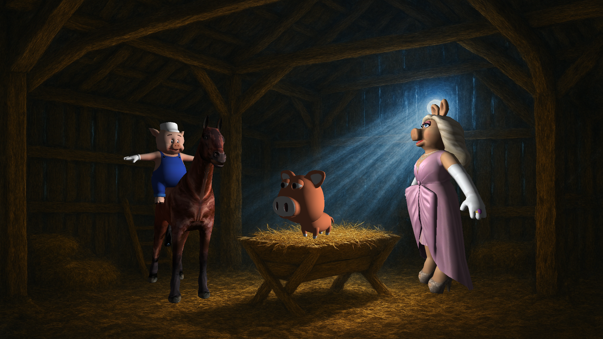
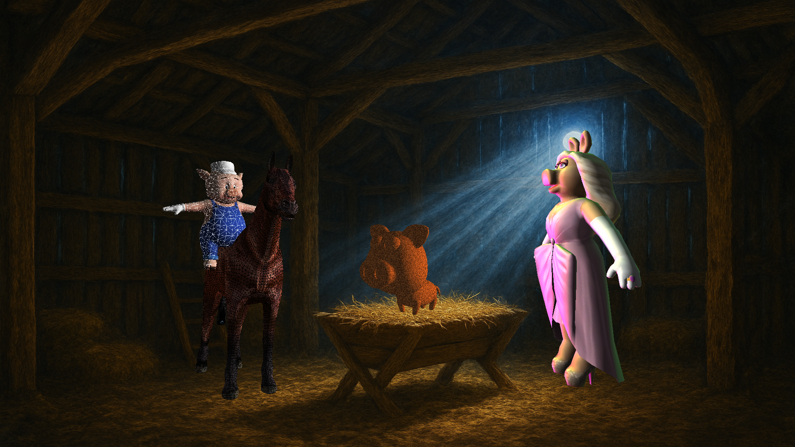

# Rasterizador 3D en Python (Pygame)

Rasterizador 3D con soporte para OBJ/MTL, texturas BMP, iluminación direccional y múltiples shaders de fragmento numerados. Incluye fondo BMP opcional y captura de pantalla.

## Características

- Pipeline de rasterización por software (vértices, normales, UVs, Z-buffer)
- Texturas desde OBJ/MTL (map_Kd) con prioridad sobre texturas de respaldo
- Shaders de fragmento básicos: Flat, Gouraud, Textured
- Shaders numerados (asignables por modelo):
  1. toonShader (cómic/cel shading con contorno)
  2. rimIridescentShader (rim + iridiscencia animada)
  3. lavaNoiseShader (lava procedural con fBm)
  4. wireframeOverlayShader (wireframe sobre iluminación)
- Luz ambiente configurable para suavizar sombras
- Fondo BMP con blit rápido
- Captura de pantalla (PNG) al disco

## Requisitos

```bash
pip install pygame numpy
```

## Ejecución

Desde `Rasterizer/General`:

```bash
python Rasterizer2025.py
```

## Controles

- Cambiar modelo activo: TAB, 1, 2, 3
- Modo render: F alterna Puntos/Triángulos
- Culling trasero: F4
- Iluminación: L
- Shaders básicos: I (Flat), O (Gouraud), P (Fragment), T (Texturizado si hay)
- Shaders numerados por modelo: Shift+1..4 (toon, rim, lava, wireframe)
- Tomas de cámara: Z (media), X (baja), C (alta), V (holandés)
- Mover modelo: Flechas (XY)
- Rotar: D/A (Z), Q/E (Y), Z/C (X)
- Escala: W/S
- Captura de pantalla: F12 (guarda en `screenshots/`)

## Capturas

Vista rápida de algunos shaders y modelos renderizados (las imágenes están en `Rasterizer/General/screenshots/`):

<p>
  
  
  
</p>

## Asignación inicial de shaders por modelo

En `Rasterizer2025.py` puedes definir:

```python
initial_shader_by_model = {
    "horse": 1,
    "misspiggy": 2,
    "piggy": 4,
    "practical": 3,
}

initial_shader_params_by_model = {
    # "horse": {"levels": 5, "edge_width": 0.05},
}
```

Los parámetros se inyectan al shader durante el render de ese modelo.

## Notas

- Los materiales MTL con `map_Kd` tienen prioridad sobre texturas de respaldo.
- El fondo BMP se escala a ventana y no afecta el Z-buffer (se limpia a infinito).
- El Z-buffer usa z menor como más cercano.

## Estructura

```
Rasterizer/
  General/
    Rasterizer2025.py   # Aplicación
    gl.py               # Motor rasterizador + fondo y Z-buffer
    shaders.py          # Shaders (incluye los numerados 1..4)
    model.py            # Modelos y datos
    texture.py          # Lector BMP robusto
    MathLib.py          # Utilidades de matrices
    BMP_Writer.py       # Export BMP (opcional)
    models/             # OBJ/MTL y recursos
    textures/           # BMP de respaldo y fondo
    screenshots/        # Capturas (F12)
```
